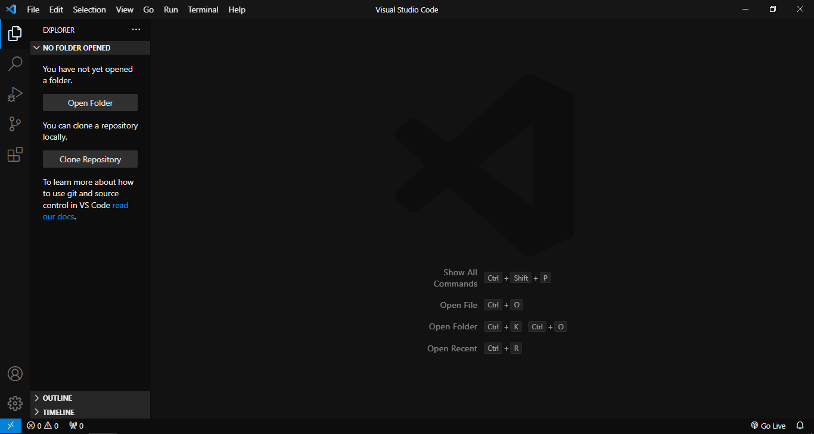

# Monokai Midnight

-  Minimalist Dark Monokai-Inspired Theme for Visual Studio Code.
-  Remove Unnecessary Borders and Improve Syntax Highlighting Colors.

## Installation

1. Open the **Extensions** Sidebar on Visual Studio Code.
2. Search for **Monokai Midnight** Theme.
3. Click **Install** to Start the Installation Process.
4. Open the Command Palette with **Ctrl/Cmd + Shift + P**.
5. Preferences: Color Theme > Select **Monokai Midnight**.

## Screenshot

## Contributing

-  Theme are currently under development and improvement.
-  If you found any problem or have a future request, please open an
   [**issue here**](https://github.com/syrizaldev/monokai-midnight/issues).
-  Thanks for the contributions and have a nice day.

## License

MIT © [**Syahrizal**](https://twitter.com/syrizaldev)
